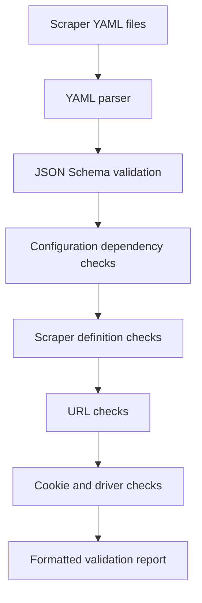
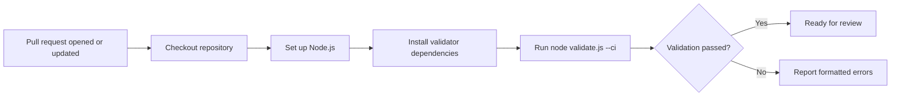

# CommunityScrapers Contributing Guide

> Migrated from [DeepWiki — Contributing | stashapp/CommunityScrapers](https://deepwiki.com/stashapp/CommunityScrapers/10.4-contributing) on August 19, 2026.
>
> Upstream repository: [stashapp/CommunityScrapers](https://github.com/stashapp/CommunityScrapers).

This document describes the process for contributing scrapers to the CommunityScrapers repository, including validation requirements, the CI pipeline, and community support channels.

For related guidance, see:

- [Creating a New Scraper](https://deepwiki.com/stashapp/CommunityScrapers/10.1-creating-a-new-scraper)
- [Stash scraper development documentation](https://docs.stashapp.cc/in-app-manual/scraping/scraperdevelopment/)
- [Stash metadata scraping documentation](https://docs.stashapp.cc/in-app-manual/scraping/)

## Relevant upstream files

- [`README.md`](https://github.com/stashapp/CommunityScrapers/blob/master/README.md)
- [`validator/index.js`](https://github.com/stashapp/CommunityScrapers/blob/master/validator/index.js)
- [`validator/scraper.schema.json`](https://github.com/stashapp/CommunityScrapers/blob/master/validator/scraper.schema.json)
- Example scrapers under [`scrapers/`](https://github.com/stashapp/CommunityScrapers/tree/master/scrapers)

## Contribution workflow

CommunityScrapers follows a standard pull-request workflow. Contributions must pass schema validation and business-logic checks before merging.

```mermaid
flowchart LR
    A[Fork repository] --> B[Create or update scraper]
    B --> C[Install validator dependencies]
    C --> D[Run local validation]
    D --> E[Test in local Stash]
    E --> F[Commit and push]
    F --> G[Open pull request]
    G --> H[Automated CI validation]
    H --> I[Community review]
    I --> J[Merge and feed publication]
```



## Step-by-step process

### 1. Development

1. Fork [stashapp/CommunityScrapers](https://github.com/stashapp/CommunityScrapers).
2. Create a scraper following the conventions in existing `.yml` files.
3. Install validator dependencies from the `validator` directory:

   ```bash
   cd validator
   yarn
   ```

4. Return to the repository root and run validation:

   ```bash
   node validate.js
   ```

5. Validate selected files when iterating:

   ```bash
   node validate.js scrapers/foo.yml scrapers/bar.yml
   ```

### Validator flags

| Flag | Purpose |
| --- | --- |
| `-d` | Allow deprecated features without producing errors. |
| `-a` | Continue after the first error and report all errors. |
| `-s` | Enforce alphabetically sorted URL lists. |
| `-v` | Show verbose output for every file. |
| `--ci` | CI mode; exits with status code `1` when validation fails. |

### 2. Local testing in Stash

Before submitting a scraper:

1. Copy it to the configured `Scrapers Path`. The default is `~/.stash/scrapers`.
2. In Stash, choose **Scrape with... → Reload scrapers**.
3. Test every implemented entry point:
   - by URL
   - by name/search
   - by fragment
4. Review Stash logs for failures:
   - **Settings → Logs**
   - Set **Log Level** to `Debug`

### 3. Submission

1. Commit changes with a descriptive message.
2. Push the branch to your fork.
3. Open a pull request containing:
   - a clear description of the scraper
   - supported sites and domains
   - supported Stash entity types and entry points
   - authentication, cookie, or API-key requirements
   - known limitations
4. Wait for the automated validation workflow to complete.
5. Respond to validation or review feedback.

## Validation system architecture

The validation system combines:

1. **JSON Schema validation**, which enforces the structural shape of scraper YAML files.
2. **Custom business-logic checks**, implemented in the Node.js validator.



## Schema validation rules

The [`validator/scraper.schema.json`](https://github.com/stashapp/CommunityScrapers/blob/master/validator/scraper.schema.json) file defines structural requirements for scraper configurations.

Important rules include:

| Property or section | Validation rule |
| --- | --- |
| `name` | Required string identifying the scraper or site. |
| `sceneByURL` | Array of URL configuration objects. Each item requires a valid `action`, `url`, and conditionally a `scraper` or `script`. |
| `xPathScrapers` | Object with alphanumeric scraper-definition keys containing scene, performer, group/movie, or gallery definitions. |
| `driver.cookies` | Cookie array whose required fields depend on the driver's CDP mode. |
| `driver.useCDP` | Boolean selecting Chrome DevTools Protocol mode or regular HTTP mode. |
| Entry-point actions | Must use a supported action such as `script`, `scrapeXPath`, `scrapeJson`, or `stash`. |

## Business-logic validation

The validator performs additional checks that cannot be represented completely in JSON Schema.

### Configuration dependencies

When `sceneByName` is configured, `sceneByQueryFragment` must also exist. The query-fragment handler processes the results returned by name search and produces the fragment used by later scrape operations.

### Referenced scraper definitions

For an entry such as:

```yaml
sceneByURL:
  - action: scrapeXPath
    url:
      - example.com/scenes/
    scraper: sceneScraper
```

a corresponding definition must exist:

```yaml
xPathScrapers:
  sceneScraper:
    scene:
      Title: //h1/text()
```

The validator checks that:

1. Every referenced scraper exists.
2. The referenced definition has the correct entity section. For example, a scraper referenced by `sceneByURL` must contain a `scene` object.
3. URL patterns are unique within each entity type.
4. URL arrays are alphabetically sorted when the `-s` option is enabled.
5. A root `stashServer` configuration exists when an entry point uses `action: stash`.

### Cookie and driver validation

Cookie requirements depend on the `driver.useCDP` setting.

| `useCDP` value | Cookie requirement |
| --- | --- |
| `false` | Every cookie entry must include `CookieURL`. |
| `true` | Cookie entries must not include `CookieURL`. |

This prevents configurations where Stash cannot apply cookies correctly.

## CI pipeline

The upstream repository uses GitHub Actions to validate scrapers automatically on pull requests.



## Docker-based local validation

The CI validation can be reproduced locally without installing Node.js directly:

```bash
docker run --rm -v .:/app node:alpine /bin/sh -c "cd /app/validator && yarn install --silent && cd .. && node validate.js --ci"
```

This command:

1. Mounts the current directory at `/app`.
2. Uses the minimal `node:alpine` image.
3. Installs validator dependencies.
4. Runs the validator in CI mode.
5. Returns a non-zero exit code when validation fails.

## Common validation failures

| Error message | Resolution |
| --- | --- |
| `xPathScrapers should contain a XPath scraper definition for X` | Add the missing `X` definition under `xPathScrapers`, or correct the reference. |
| `URLs should be unique` | Remove duplicate URL patterns within the same entity type. |
| `sceneByName requires sceneByQueryFragment` | Add a compatible `sceneByQueryFragment` configuration. |
| `CookieURL is required because useCDP is false` | Add `CookieURL` to every cookie entry, or use CDP mode correctly. |
| `CookieURL is not allowed because useCDP is true` | Remove `CookieURL` from cookie entries. |
| `URL list should be sorted` | Sort URL patterns alphabetically. |

A formatted validation error generally identifies the file, JSON path, and missing or invalid property. Use that path to locate the configuration requiring correction.

## Community support

### Discourse forum

Use the [Stash Discourse forum](https://discourse.stashapp.cc/) for:

- long-form discussions
- searchable questions and answers
- bug reports
- feature requests
- detailed troubleshooting

### Discord

For real-time help, join the [Stash Discord server](https://discord.gg/2TsNFKt) and use the `#scrapers` channel.

When requesting help, include:

1. Stash version. Community scrapers generally require at least Stash `v0.24.0` for feed-based installation.
2. Scraper name.
3. URL being scraped.
4. Python version, when the scraper uses Python.
5. Relevant debug logs from **Settings → Logs**.

### Documentation resources

| Resource | Purpose |
| --- | --- |
| [Guide to Scraping](https://docs.stashapp.cc/beginner-guides/guide-to-scraping/) | User-friendly scraping guide. |
| [Scraper development manual](https://docs.stashapp.cc/in-app-manual/scraping/scraperdevelopment/) | Technical scraper configuration reference. |
| [Metadata scraping manual](https://docs.stashapp.cc/in-app-manual/scraping/) | Instructions for using scrapers in Stash. |
| [CommunityScrapers site list](https://stashapp.github.io/CommunityScrapers/) | Searchable list of supported sites. |

## Manually configured scrapers

Some scrapers require manual configuration even when installed through the Community feed. Typical requirements include:

- API keys
- authentication cookies
- user-specific tokens
- custom Stash GraphQL endpoints

Updates installed through the feed can overwrite changes made directly to feed-managed files, so review each scraper's instructions before editing it.

### Configuration locations

Python scrapers that communicate with Stash may use `py_common/config.ini` for values such as:

- GraphQL endpoint, commonly `http://localhost:9999/graphql`
- API key, when authentication is enabled
- scraper-specific settings

Other Python scrapers may create `scrapers/{ScraperName}/config.ini` the first time they run.

### Cookie-based authentication

A common authentication pattern is:

1. Log in to the target website in a browser.
2. Open browser developer tools.
3. Navigate to **Application** or **Storage → Cookies**.
4. Copy the required cookie value.
5. Add it to the scraper's driver configuration according to that scraper's instructions.

Do not commit personal cookies, authentication tokens, API keys, or other secrets to a public repository.

## Validation examples

Validate one scraper:

```bash
node validate.js scrapers/WowPorn.yml
```

Expected successful output resembles:

```text
scrapers/WowPorn.yml Valid: true
```

Validate multiple scrapers:

```bash
node validate.js scrapers/foo.yml scrapers/bar.yml
```

Show verbose results for all scrapers:

```bash
node validate.js -v
```

Allow deprecated features:

```bash
node validate.js -d
```

Run all checks and enforce sorted URL lists:

```bash
node validate.js -a -s
```

Run in CI mode:

```bash
node validate.js --ci
```

## Post-merge distribution

After an upstream pull request merges into the CommunityScrapers `master` branch, the updated scraper becomes available through the Community stable feed.

### Feed-based installation

Users can install or update it in Stash:

1. Open **Settings → Metadata Providers**.
2. Select the **Community (stable)** feed.
3. Open **Available Scrapers**.
4. Install or update the scraper.

### Manual updates

For manually managed scrapers:

1. Copy the updated `.yml` file to the configured `Scrapers Path`.
2. Choose **Scrape with... → Reload scrapers** in Stash.
3. Refresh the relevant scene, performer, group, or gallery page.

Manual and feed-managed scrapers can coexist. Manually installed scrapers take precedence when both provide the same scraper.

## Summary

The contribution process is designed to catch configuration errors before they reach users:

1. Develop and test locally in Stash.
2. Run the validator before submitting.
3. Open a pull request.
4. Allow CI validation to run.
5. Resolve reported errors and review feedback.
6. Merge after validation and review pass.
7. Publish through the Community stable feed.

The combination of structural JSON Schema validation and targeted business-logic checks helps ensure that scrapers are internally consistent, compatible with Stash, and maintainable by the community.

## Attribution

This migrated guide summarizes and preserves the structure of the DeepWiki page and upstream CommunityScrapers documentation. Refer to the [upstream repository](https://github.com/stashapp/CommunityScrapers) for the authoritative, current versions of the validator and scraper examples.